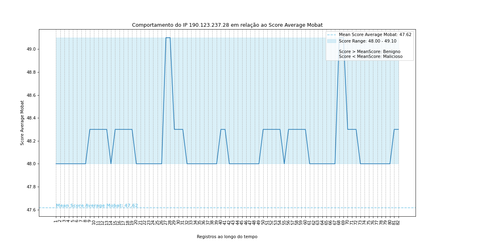
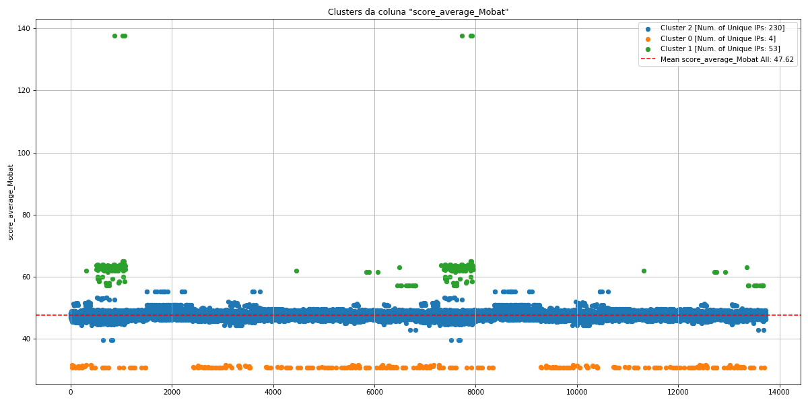
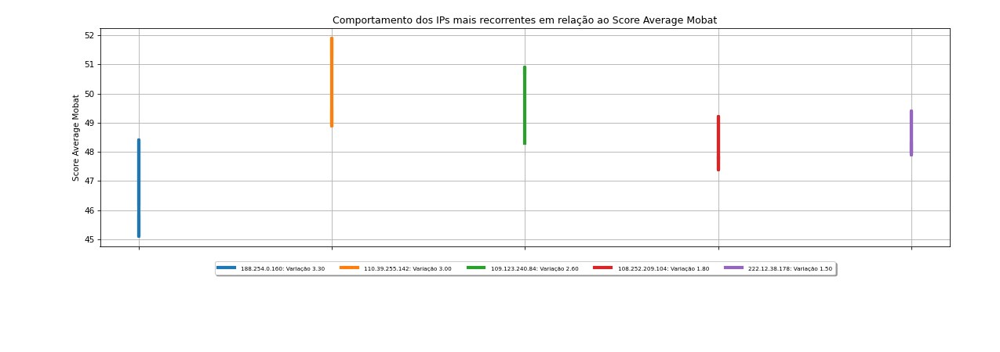
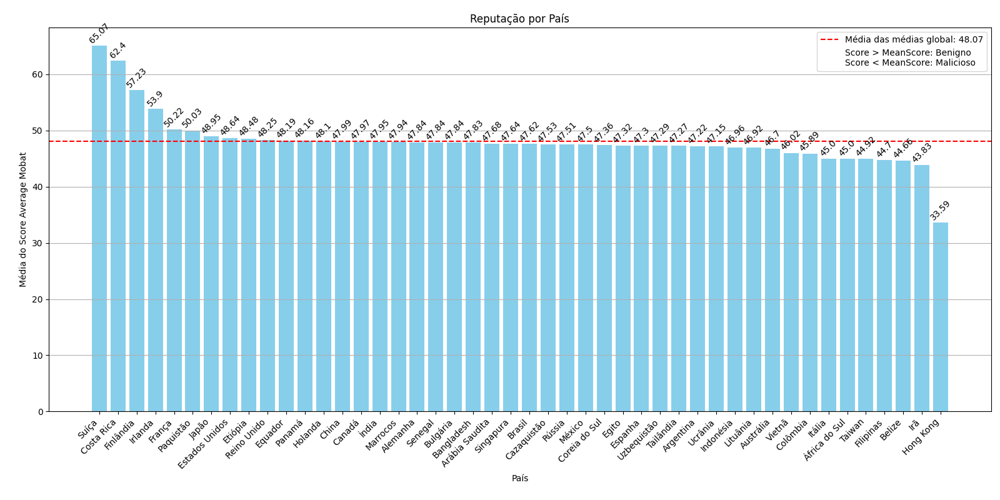
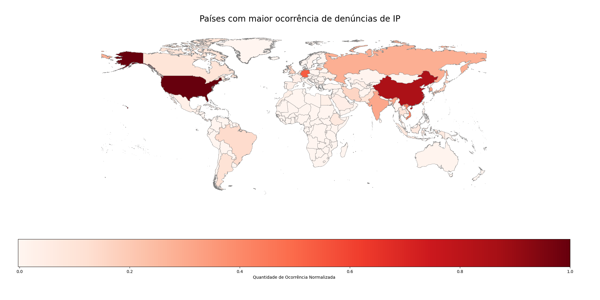

# Mobat Project

Sistema de análise de reputação de endereços IP baseado em múltiplas fontes de inteligência de ameaças (AbuseIPDB, VirusTotal, IBM X-Force, AlienVault, Shodan). O projeto fornece visualizações, clusters, seleção de features e modelos de Machine Learning para classificar o risco de IPs.

## Tecnologias

- Django 4.2
- Python 3.12
- Pandas, Scikit-learn, XGBoost
- Matplotlib, Seaborn, GeoPandas
- SQLite (dados por semestre)

## Instalação e Execução com Docker

```bash
git clone <seu-repositorio>
cd mobat_project
docker compose build --no-cache
docker compose up
```

Acesse http://localhost:8000

## Funcionalidades

- Visualização de dados por semestre
- Gráficos de comportamento individual de IP
- Mapeamento de features (contagem de valores)
- Clustering não supervisionado
- Seleção de características (VarianceThreshold, SelectKBest, Lasso, Mutual Information)
- Importância de features com diferentes regressores
- Score médio Mobat por IP e por país
- Heatmap geográfico de ocorrências
- Tabela de acurácia comparando modelos com/sem seleção de features
- Download dos dados em diversos formatos (Excel, CSV, Parquet, JSON, XML, etc.)

## Exemplos de Gráficos Gerados

### Comportamento do Score Médio



### Clusters



### Top IPs com maior variação



### Reputação por País



### Heatmap de ocorrências



## Como usar

- Na página inicial, selecione o semestre desejado.
- Explore as abas de Gráficos de Comportamento, Clusters, Score Average Mobat, Reputação por País, Heatmap, Seleção de Características, Importância de Features, Tabela de Acurácia e Download de Tabela.

## Estrutura do Projeto

- `mobat_app/views/` - lógica por funcionalidade
- `mobat_app/utils/` - helpers para plotagem e ML
- `mobat_app/Seasons/` - bancos SQLite com dados semestrais
- `mobat_app/shapefiles/` - arquivos para mapas
